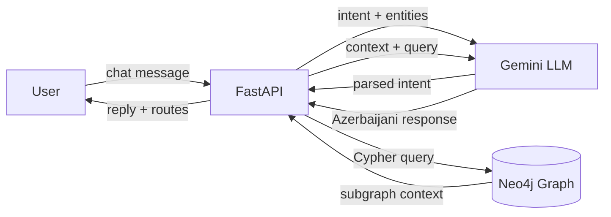
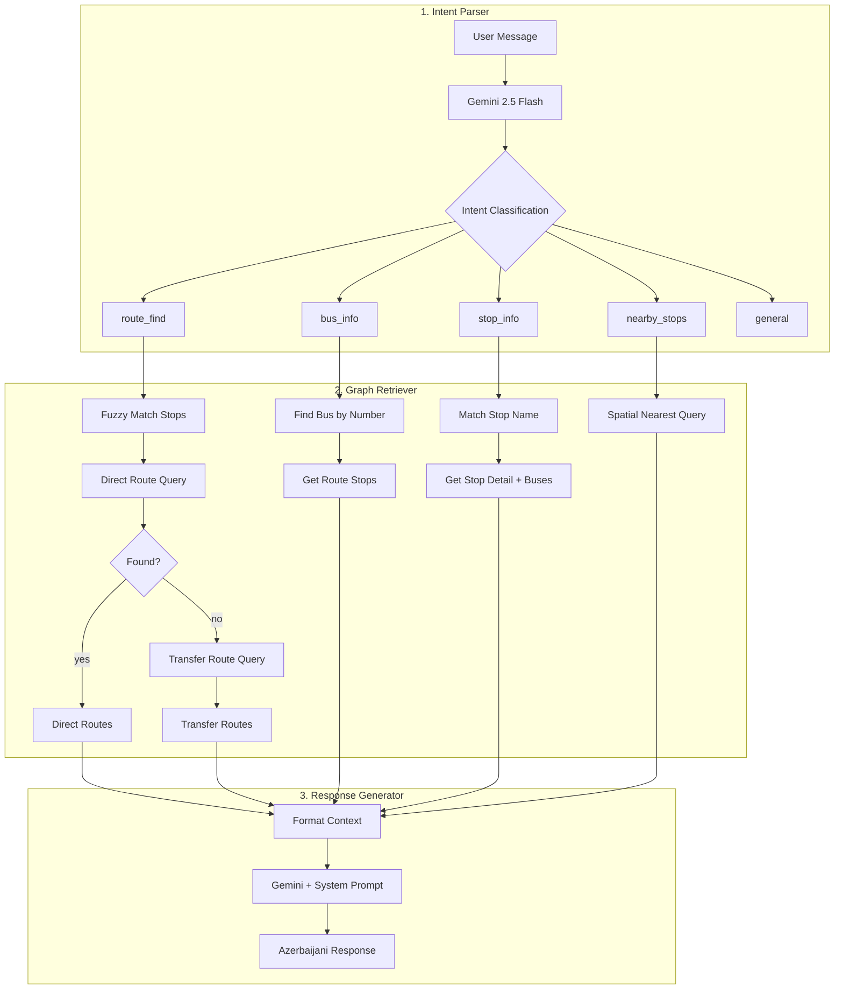
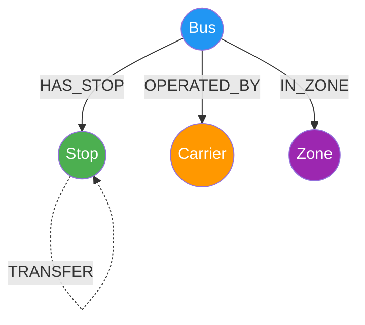
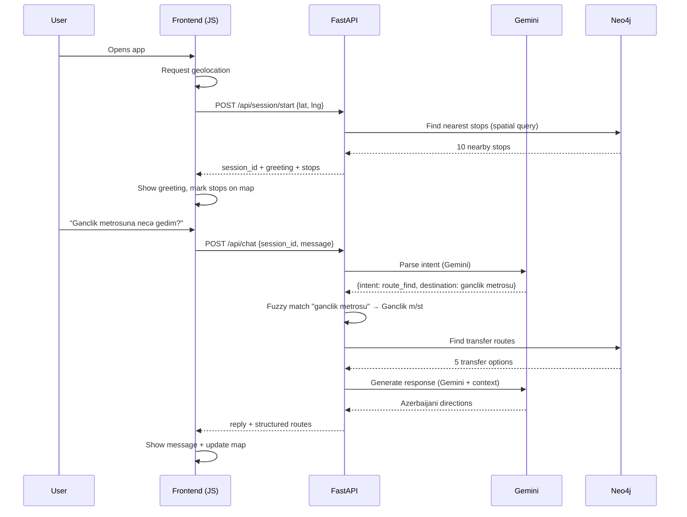
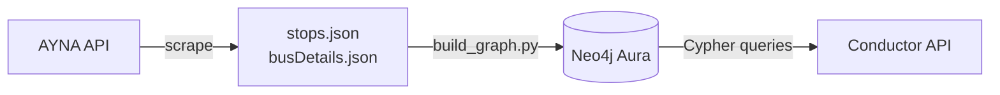

# Conductor

**Bakı ictimai nəqliyyat köməkçisi** — An AI-powered Baku public transportation assistant built with Graph RAG architecture.

**Live Demo:** [conductor-3z8a.onrender.com](https://conductor-3z8a.onrender.com/)

> **Note:** The live demo runs on Render's free tier. If the instance has been idle, the first request takes **1-3 minutes** to wake up. Subsequent requests are fast.

---

## What It Does

Conductor lets users ask natural language questions about Baku's bus system in Azerbaijani and get accurate, real-time answers:

- **"Gənclik metrosuna hansı avtobus gedir?"** — finds bus routes from your location to Gənclik metro
- **"3 nömrəli avtobus haqqında məlumat ver"** — shows bus #3 details, route, stops, and fare
- **"Yaxınlıqda dayanacaq var?"** — lists nearby stops with distances
- **"28 May metrosundan Koroğlu metrosuna necə gedim?"** — finds direct or transfer routes

---

## Tech Stack

| Layer | Technology |
|---|---|
| **Backend** | Python 3.13, FastAPI, Uvicorn |
| **Database** | Neo4j Aura (graph database, HTTP API v2) |
| **LLM** | Google Gemini 2.5 Flash (intent parsing + response generation) |
| **Frontend** | Jinja2, Vanilla JS, Leaflet.js (maps), CSS Grid |
| **Deployment** | Docker, Render |
| **Data Source** | AYNA (Azerbaijan Road Transport Agency) API |

---

## Architecture

### High-Level Flow



### Graph RAG Pipeline



### Graph Data Model



| Node | Count | Key Properties |
|---|---|---|
| **Stop** | 3,456 | name, coordinates, spatial index |
| **Bus** | 208 | number, carrier, route, fare |
| **Carrier** | 43 | company name |
| **Zone** | 7 | urban/suburban classification |

| Relationship | Count | Description |
|---|---|---|
| **HAS_STOP** | 11,786 | Bus serves stop (with direction + order) |
| **NEXT_STOP** | 11,357 | Sequential stops on a route |
| **TRANSFER** | 7,492 | Walking transfers between nearby stops (<300m) |
| **OPERATED_BY** | 208 | Bus → operating company |
| **IN_ZONE** | 208 | Bus → working zone |

### Request Lifecycle



---

## Project Structure

```
conductor/
├── conductor/                  # Main Python package
│   ├── main.py                 # FastAPI app entry point
│   ├── config.py               # Environment configuration
│   ├── session.py              # Session & location management
│   ├── api/
│   │   ├── routes.py           # HTTP route handlers
│   │   └── models.py           # Pydantic request/response models
│   ├── graph/
│   │   ├── client.py           # Neo4j HTTP API v2 client
│   │   ├── queries.py          # Cypher query templates
│   │   └── retriever.py        # Graph retrieval logic
│   ├── rag/
│   │   ├── parser.py           # Intent classification (Gemini)
│   │   ├── generator.py        # Response generation (Gemini)
│   │   └── prompts.py          # System prompts (Azerbaijani)
│   ├── matching/
│   │   ├── aliases.py          # Landmark → stop name mapping
│   │   ├── fuzzy.py            # Fuzzy stop name matching
│   │   └── transliterate.py    # Azerbaijani character normalization
│   ├── static/
│   │   ├── css/style.css       # Responsive UI styles
│   │   ├── js/app.js           # Chat, map, geolocation logic
│   │   └── favicon.svg         # App icon
│   └── templates/
│       └── index.html          # Main HTML template
├── scripts/
│   ├── build_graph.py          # JSON → Neo4j graph ingestion
│   ├── busDetails.py           # AYNA API bus data scraper
│   └── stops.py                # AYNA API stop data scraper
├── data/
│   ├── busDetails.json         # 208 bus routes
│   └── stops.json              # 3,841 stops
├── docs/                       # Documentation
│   ├── system-design.md        # Full system design document
│   ├── api-reference.md        # API endpoint reference
│   ├── graph-schema.md         # Neo4j graph model documentation
│   ├── rag-pipeline.md         # RAG architecture details
│   ├── fuzzy-matching.md       # Transliteration & matching rules
│   └── deployment.md           # Deployment guide
├── Dockerfile
├── docker-compose.yml
├── .env.example
├── requirements.txt
└── README.md
```

---

## Quick Start

### 1. Prerequisites

- Python 3.10+
- [Neo4j Aura](https://neo4j.com/cloud/aura-free/) account (free tier)
- [Google Gemini API key](https://aistudio.google.com/apikey) (free tier)

### 2. Setup

```bash
git clone <repo-url>
cd conductor
python -m venv venv
source venv/bin/activate  # Windows: venv\Scripts\activate
pip install -r requirements.txt
```

### 3. Configure

```bash
cp .env.example .env
# Edit .env with your Neo4j and Gemini credentials
```

### 4. Build the graph

```bash
python scripts/build_graph.py
```

### 5. Run

```bash
uvicorn conductor.main:app --host 0.0.0.0 --port 8000
```

Open [http://localhost:8000](http://localhost:8000)

### Docker

```bash
docker-compose up --build
```

---

## Key Features

### Azerbaijani NLP
- Fuzzy matching with transliteration (`genclik` → `gənclik`)
- Alias dictionary for metro stations and landmarks
- Full Azerbaijani system prompts and responses

### Location-Aware Routing
- Browser geolocation on session start
- Spatial queries find nearest stops within 500m
- Routes calculated from user's actual position

### Transfer Detection
- Stops within 300m automatically linked via TRANSFER edges
- Walking distance and time calculated (72 m/min)
- One-transfer routes with step-by-step directions

### Edge Case Handling
- Geolocation denied → works without location, asks when needed
- Session expired → auto-creates new session
- Rate limit → friendly Azerbaijani message
- No route found → suggests alternatives
- Network error → user-facing error message

---

## Data Pipeline



The data comes from the Azerbaijan Road Transport Agency (AYNA) API at `map-api.ayna.gov.az`. Scraper scripts fetch bus routes and stop data, which is then ingested into Neo4j through a 7-phase pipeline:

1. **Constraints & indexes** — uniqueness constraints, spatial index
2. **Stop nodes** — 3,456 stops with coordinates
3. **Carrier & Zone nodes** — 43 carriers, 7 zones
4. **Bus nodes** — 208 routes with OPERATED_BY and IN_ZONE
5. **HAS_STOP relationships** — 11,786 bus-stop connections
6. **NEXT_STOP relationships** — 11,357 sequential stop links
7. **TRANSFER relationships** — 7,492 walking transfer edges

---

## Documentation

| Document | Description |
|---|---|
| [System Design](docs/system-design.md) | Full system architecture and design decisions |
| [API Reference](docs/api-reference.md) | All HTTP endpoints with examples |
| [Graph Schema](docs/graph-schema.md) | Neo4j node/relationship model and Cypher queries |
| [RAG Pipeline](docs/rag-pipeline.md) | Intent parsing, retrieval, and generation flow |
| [Fuzzy Matching](docs/fuzzy-matching.md) | Azerbaijani transliteration and name resolution |
| [Deployment Guide](docs/deployment.md) | Docker, Render, and local setup instructions |

---

## Environment Variables

See [`.env.example`](.env.example) for the full list. Key variables:

| Variable | Required | Description |
|---|---|---|
| `NEO4J_HTTP_URL` | Yes | Neo4j Aura HTTP API endpoint |
| `NEO4J_PASSWORD` | Yes | Neo4j password |
| `GEMINI_API_KEY` | Yes | Google Gemini API key |
| `MODEL_NAME` | No | Gemini model (default: `gemini-2.5-flash`) |
| `DISABLE_SSL_VERIFY` | No | `true` for corporate proxy environments |

---

## License

This project was built as a demonstration of Graph RAG architecture applied to real-world public transportation data.
